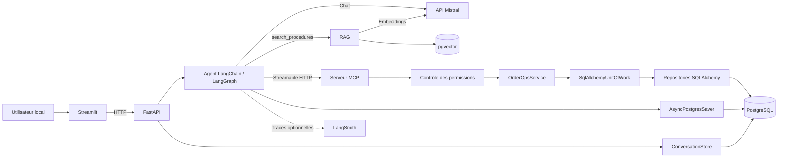
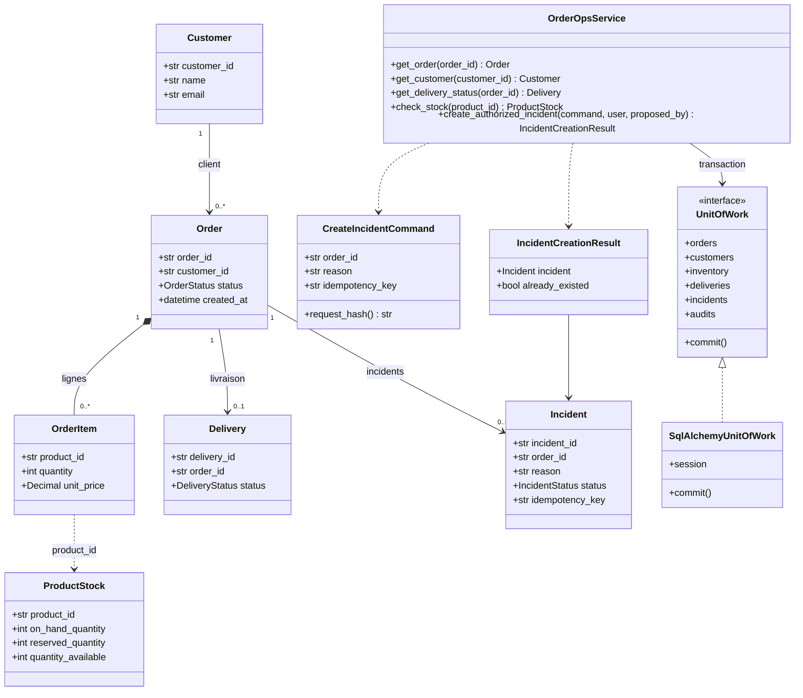
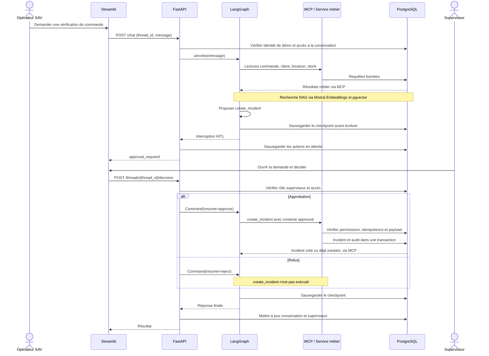

# Architecture et UML du MVP

Ce document décrit les composants du MVP local, leurs interactions et la persistance
des conversations. Les diagrammes Mermaid sont lisibles directement dans GitHub.
Les capacités et permissions sont détaillées dans le [guide de l'agent](agent-outils-et-roles.md).

## Composants

PostgreSQL héberge les tables métier, les conversations, les checkpoints et les
vecteurs. Les checkpoints LangGraph et les tables pgvector sont gérés par leurs
bibliothèques respectives. Le service MCP propose quatre lectures et une écriture :
`get_order`, `get_customer`, `get_delivery_status`, `check_stock`, `create_incident`.

## Classes métier et orchestration

Vue simplifiée des modèles de `src/orderops/domain/models.py`, du service et de son
unité de travail. Les associations représentent les identifiants métier ; elles
ne signifient pas que chaque modèle Pydantic charge des objets liés.

Les modèles métier sont immuables. La base impose une seule livraison par commande,
un stock réservé inférieur ou égal au stock physique, ainsi qu'une clé d'idempotence
unique pour les incidents. Le hash du payload distingue une répétition valide d'un
conflit. L'incident et son audit sont écrits dans une même transaction.

## Séquence : demande et validation d'un incident

Les identités Lecteur, Opérateur et Superviseur sont simulées, sans authentification.
Un utilisateur actif possède au plus un rôle dans le schéma actuel. Une conversation
a un propriétaire et éventuellement un superviseur ayant traité la demande.
Le verrou par conversation reste en mémoire dans un unique worker API.

## Identité et contrôle des appels

Streamlit transmet l'identifiant du profil dans l'en-tête `X-Demo-User-Id`.
L'API relit en PostgreSQL l'état actif, le rôle et les droits d'accès à la
conversation. Le rôle n'est pas accepté dans le corps JSON de la requête.

L'agent transmet au MCP le jeton interne, l'identité, le thread et la décision
fournis par le serveur. Ces informations ne figurent pas dans les arguments
métier produits par le modèle. `MCP_INTERNAL_TOKEN` doit avoir la même valeur
dans l'API et le MCP ; sa valeur publique de démonstration ne fournit pas
d'authentification utilisateur.

Avant une création, le MCP vérifie le rôle du superviseur, la décision serveur
et la correspondance des arguments avec la proposition en attente. Le service
métier vérifie ensuite le rôle et les contraintes métier dans la transaction.
L'audit enregistre le superviseur dans `action_audit.actor` et le propriétaire
de la conversation dans `action_audit.details.proposed_by`.

## Persistance des conversations

| Stockage PostgreSQL | Contenu |
| --- | --- |
| `users`, `roles`, `user_roles` | Profils simulés, état actif et permissions. |
| `conversations` | UUID du thread, propriétaire, titre, statut, actions en attente, superviseur ayant traité la demande et dates. |
| Tables `checkpoint*` | Historique LangGraph, résultats des outils et état de pause/reprise. |

L'interface recharge les messages depuis le checkpointer après réouverture du
navigateur ou redémarrage de l'API. Les messages d'erreur d'affichage restent
locaux à la session Streamlit ; l'état déjà sauvegardé reste en base.

La migration des profils et conversations est additive. Elle conserve les tables
et checkpoints antérieurs, mais n'attribue pas automatiquement les anciens threads
sans propriétaire : ces threads ne deviennent pas visibles dans les profils.
Les commandes de mise à jour sans réingestion figurent dans le
[README](../README.md#mise-à-jour-locale).

Le volume PostgreSQL conserve les données après `docker compose down`.
`docker compose down -v` supprime ce volume. Cette persistance ne remplace pas
une sauvegarde externe.

### Suppression et transactions

La suppression d'un chat nécessite une confirmation dans l'interface et reste
réservée au propriétaire. Elle supprime d'abord les checkpoints, blobs et écritures
LangGraph du thread, puis ses métadonnées. Une proposition en attente disparaît
sans être exécutée ; les incidents créés, l'audit métier et les traces LangSmith
restent conservés. Les sauvegardes externes peuvent contenir l'ancien historique.

Les métadonnées et les checkpoints utilisent des transactions distinctes, sans
atomicité commune. Si la suppression des métadonnées échoue après celle des
checkpoints, une nouvelle tentative permet de terminer le nettoyage.
Le verrou en mémoire ne coordonne pas plusieurs processus API : une exécution
avec plusieurs workers ou instances nécessite une coordination partagée.

## Routes API

Les routes ci-dessous requièrent `X-Demo-User-Id`, à l'exception de `/demo/users`,
public dans le mode de démonstration. Les schémas de requête et de réponse sont
accessibles dans la documentation FastAPI sur <http://127.0.0.1:8000/docs>.

| Route | Fonction |
| --- | --- |
| `GET /demo/users` | Profils disponibles. |
| `POST /conversations` | Création d'une conversation avec UUID serveur et propriétaire. |
| `GET /conversations` | Chats personnels et demandes déjà traitées par le superviseur. |
| `GET /conversations/{thread_id}` | Historique, actions en attente et droits de la session. |
| `DELETE /conversations/{thread_id}` | Suppression par le propriétaire ; réponse `204`. |
| `POST /chat` | Message du propriétaire dans une conversation sans action en attente. |
| `GET /approvals` | Demandes accessibles en attente ; superviseur uniquement. |
| `POST /threads/{thread_id}/decision` | Approbation ou refus ; superviseur uniquement. |

Une identité absente renvoie `401`, une permission refusée `403`, une conversation
inaccessible `404` et une reprise sans action en attente `409`. Chaque décision
couvre toutes les actions de la proposition. Une deuxième approbation après
traitement est refusée.

Les tests d'intégration sur `orderops_test` couvrent le transport MCP, la reprise
des checkpoints, les permissions, l'approbation/refus et l'audit avec un modèle
simulé. Les commandes sont regroupées dans le [README](../README.md#développement-et-tests).
